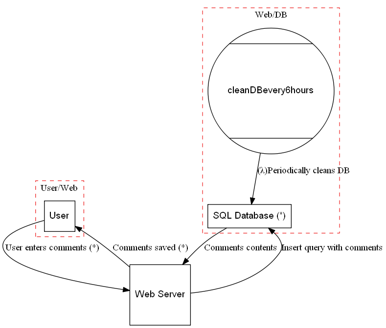

# WARNING: this project is no longer maintained

# Background: 
pySCS is a heavily customized fork of [pytm](https://github.com/izar/pytm) that tried to fix 2 things:
* load threats from an excel file
* run everything from python

# pySCS is a pythonic framework to automate security control selection
Define your system in Python using the elements and properties described in the pySCS framework. 
Based on your definition, pySCS can generate a Data Flow Diagram (DFD), a Sequence Diagram, and a list of applicable controls to your system.

## Requirements

* Linux/MacOS/Windows 10
* Python 3.x
* Graphviz package

Python modules
* pandas
* pyplot
* pypandoc
* pillow

## Usage

```text
pySCS.py folder [-h] [--file FILENAME] [--debug] [--template TEMPLATE] [format FORMAT] [--list] [--listfull] [--describe DESCRIBE] 

required arguments:
  folder               location of model to process
  
optional arguments:
  -h, --help           show this help message and exit
  --file               filename of model to use (defaut is model.py)
  --debug              print debug messages
  --template TEMPLATE  output report using the specified markup template file
  --format FORMAT      choose html or pdf (html is default)
  --list               list used controls in model
  --listfull           same as --list but with full details
  --describe DESCRIBE  describe the contents of a given class

```

## Models
Models are descriptions of your system written in python. As such they can be treated as any other piece of code.
Models consist of the following components (with the graph counterpart in brackets):
* Elements (nodes)
* Dataflows (edges)
* Boundaries (subgraphs)

Elements use the following hiarchy for inhereting properties:
```text
Element
  +-Actor
  +-Dataflow
  +-System
      +-Server
      +-Datastore
      +-Process
      +-SetOfProcesses
      +-Dataflow
      +-ExternalEntity
      +-Lambda

The available properties of an element can be listed by using `--describe` followed by the name of an element.

Elements should at least contain the following properties:
* name
* description
* inBoundary
```

## Controls
Controls are loaded via the csv files in the 'controls' folder. You can add your own lists by simply creating a csv file with the following structure:

```text
ID;Description;Source;Target;Condition;Comments
```

## Sample
The sample file provided in this repo contains a simple sample of a description; you can find it under 'models\sample\model.py'

## Output
The tool creates a report containing a Dataflow Diagram (generated with pyplot)

An example Dataflow Diagram: 


The diagrams and findings can be included in the template to create a final report. The report is created with a markup template. A sample report is provided under 'templates'.
