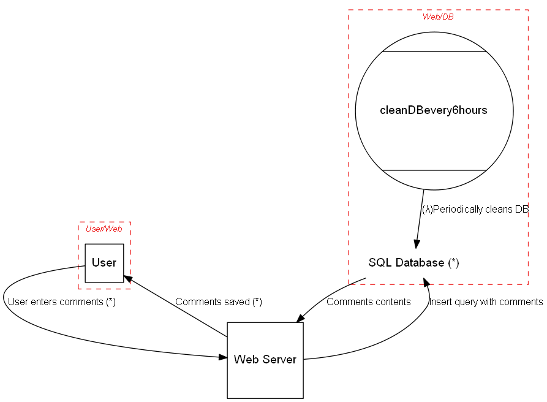

# pySCS is a pythonic framework to automate security control selection
Define your system in Python using the elements and properties described in the pySCS framework. 
Based on your definition, pySCS can generate a Data Flow Diagram (DFD), a Sequence Diagram, and a list of applicable controls to your system.

## Requirements

* Linux/MacOS/Windows 10
* Python 3.x
* Graphviz package
* Java (OpenJDK 10 or 11)
* [plantuml.jar](http://sourceforge.net/projects/plantuml/files/plantuml.jar/download)


## Usage

```text
pySCS.py folder [-h] [--file FILENAME] [--debug] [--dfd] [--report REPORT] [--exclude EXCLUDE] [--seq] [--list] [--describe DESCRIBE] 

required arguments:
  folder               location of model to process
  
optional arguments:
  -h, --help           show this help message and exit
  --file               filename of model to use (defaut is model.py)
  --debug              print debug messages
  --dfd                output DFD
  --report REPORT      output report using the named template file (sample template file is under docs/template_test.md)
  --exclude EXCLUDE    specify threat IDs to be ignored
  --seq                output sequence diagram
  --list               list used controls in model
  --listfull           same as --list but with full details
  --describe DESCRIBE  describe the contents of a given class

```

## Models
Models are descriptions of your system written in python. As such they can be treated as any other piece of code.
Models consist of the following components
* Elements
* Boundaries

Elements use the following hiarchy for inhereting properties:
```text
Element
  +-Actor
  +-Dataflow
  +-System
      +-Server
      +-Datastore
      +-Process
      +-SetOfProcesses
      +-Dataflow
      +-ExternalEntity
      +-Lambda

The available properties of an element can be listed by using `--describe` followed by the name of an element.

Elements should at least contain the following properties:
* name
* description
* inBoundary
```

## Controls
Controls are loaded via the csv files in the 'controls' folder. You can add your own lists by simply creating a csv file with the following structure:

```text
ID;Description;Source;Target;Condition;Comments
```

## Sample
The sample file provided in this repo contains a simple sample of a description

```python

scs = SCS("my test model")
scs.description = "sample to show pySCS"

User_Web = Boundary("User/Web")
Web_DB = Boundary("Web/DB")

user = Actor("User")
user.inBoundary = User_Web

web = Server("Web Server")
web.OS = "CloudOS"
web.isHardened = True

db = Datastore("SQL Database (*)")
db.OS = "CentOS"
db.isHardened = False
db.inBoundary = Web_DB
db.isSql = True
db.inScope = False

my_lambda = Lambda("cleanDBevery6hours")
my_lambda.hasAccessControl = True
my_lambda.inBoundary = Web_DB

my_lambda_to_db = Dataflow(my_lambda, db, "(&lambda;)Periodically cleans DB")
my_lambda_to_db.protocol = "SQL"
my_lambda_to_db.dstPort = 3306

user_to_web = Dataflow(user, web, "User enters comments (*)")
user_to_web.protocol = "HTTP"
user_to_web.dstPort = 80
user_to_web.data = 'Comments in HTML or Markdown'
user_to_web.order = 1

web_to_user = Dataflow(web, user, "Comments saved (*)")
web_to_user.protocol = "HTTP"
web_to_user.data = 'Ack of saving or error message, in JSON'
web_to_user.order = 2

web_to_db = Dataflow(web, db, "Insert query with comments")
web_to_db.protocol = "MySQL"
web_to_db.dstPort = 3306
web_to_db.data = 'MySQL insert statement, all literals'
web_to_db.order = 3

db_to_web = Dataflow(db, web, "Comments contents")
db_to_web.protocol = "MySQL"
db_to_web.data = 'Results of insert op'
db_to_web.order = 4
```

## Output
Diagrams are output as [Dot](https://graphviz.gitlab.io/) and [PlantUML](https://plantuml.com/).

When `--dfd` argument is passed to the above `pySCS.py` file it generates output to stdout, which is fed to Graphviz's dot to generate the Data Flow Diagram:

```bash

pySCS.py folder_of_model --dfd | dot -Tpng -o sample.png

```

Generates this diagram:




The following command generates a Sequence diagram.

```bash

pySCS.py folder_of_model  --seq | java -Djava.awt.headless=true -jar plantuml.jar -tpng -pipe > seq.png

```

and generates this diagram:


The diagrams and findings can be included in the template to create a final report:

```bash

pySCS.py folder_of_model  --report templates/template_sample.md | pandoc -f markdown -t html > report.html

```
The templating format used in the provided report template is very simple:

```text

# Security Control Selection Sample
***

## System Description

{scs.description}

## Dataflow Diagram


## Sequence Diagram


## Dataflows

Name|From|To |Data|Protocol|Port
----|----|---|----|--------|----
{dataflows:repeat:{{item.name}}|{{item.source.name}}|{{item.sink.name}}|{{item.data}}|{{item.protocol}}|{{item.dstPort}}
}

## Findings

{findings:repeat:* {{item.description}} on element "{{item.target}}"
}

```

